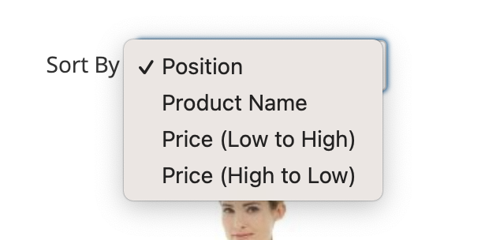

# Magento 2 - Catalog toolbar custom sorter module

Customize and optimize the default product listing sort by, include the direction in a single select element.

## Installation

1. Install module via composer `composer require mons/magento-toolbar-sorter`
2. Register module `php bin/magento setup:upgrade`

## Configuration

1. Navigate to _Stores > Attributes > Product_
2. Choose the sortable attribute you want to configure
3. From the _"Storefront Properties"_ tab, turn on the _"Used for Sorting in Product Listing"_, then choose the behavior from _"Product Listing Sorter"_ (see the options below)

### Options

* __Default (do not override)__: use Magento's default sorting setting (normally ascending)
* __Ascending__: show only the option for ascending (from low to high) order
* __Descending__: show only the option for descending (from high to low) order
* __Ascending + Descending__: show both the options above, ascending first
* __Descending + Ascending__: show both the options, descending first

### Theming

This module __doesn't__ override the default template `Magento_Catalog::product\list\toolbar\sorter.phtml`, giving you the full control on it.
Anyhow a working sample is provided as `Mons_ToolbarSorter::product\list\toolbar\sorter.phtml`.

## Tested working with

* Magento 2.4
* PHP 8.1

## Contribution

* Fork this repository
* Create your feature branch (`git checkout -b feature/your-new-feature`) or a bugfix branch (`git checkout -b bugfix/bug-short-description`) *always* from `develop`
* Commit and submit a new Pull Request
